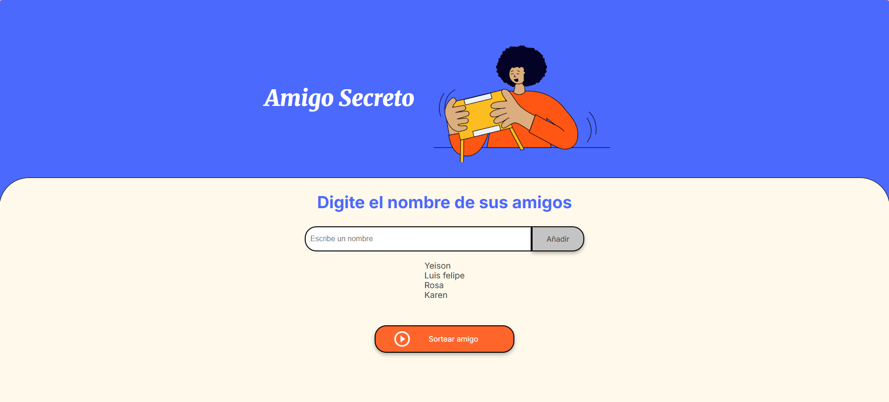
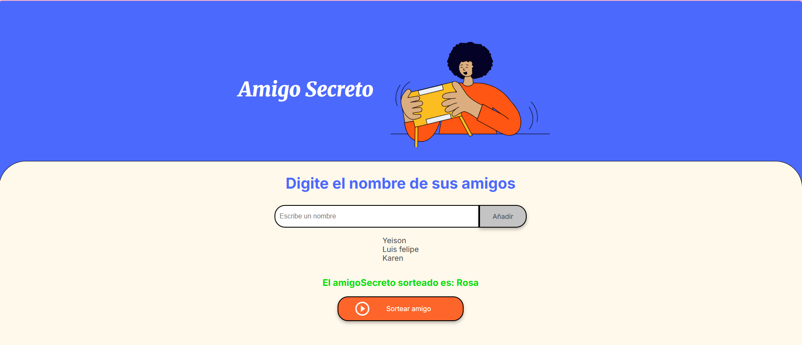
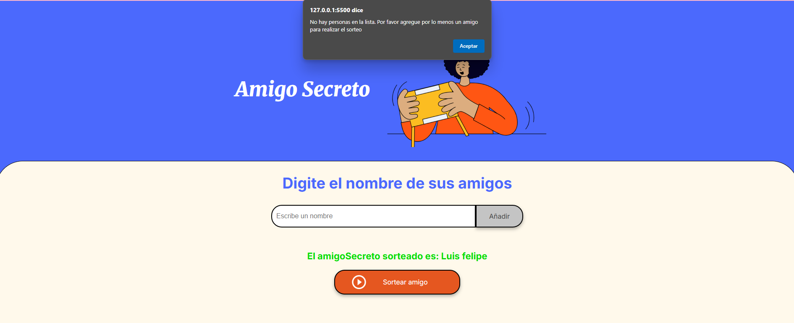
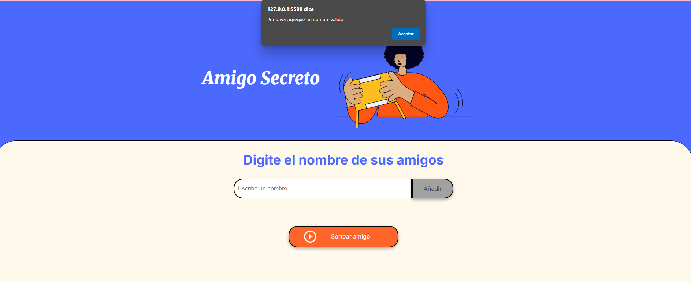

# Challenge Amigo Secreto

**Descripción:** Desafío propuesto por Alura Latam en el marco de la programa Alura one en conjunto con Oracle Next Education 

**Desarrollado por:** Ing. Silvia Mesino

## Requerimiento

Desarrollo de una aplicación que permite a los usuarios ingresar nombres de amigos en una lista para luego realizar un sorteo aleatorio y determinar quién es el "amigo secreto". El usuario deberá agregar nombres mediante el campo de texto y el botón "Adicionar". Los nombres ingresados se mostrarán en una lista visible en la página, y al finalizar, presionando el botón "Sortear Amigo" el sistema seleccionará uno de los nombres de forma aleatoria, mostrando el resultado en pantalla.

## Vista de funcionalidad

1- El usuario ingresa los nombres de amigos y el sistema los organiza en formato de lista.

2- Al presionar el botón **Sortear amigo** el sistema selecciona el amigo secreto de manera aleatoria, lo muestra en pantalla y lo elimina de la lista de amigos disponibles para sortear.

## Validaciones adicionales

1- El sistema valida que se ingrese el nombre del amigo en el campo de texto antes de poder añadir el dato a la lista para el sorteo.

2- El sistema valida que exita por lo menos un amigo en la lista para poder realizar el sorteo

